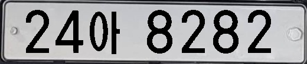
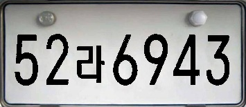

# Korean License Plate Generator

Run
```buildoutcfg
git clone https://github.com/yakhyo/Korean-License-Plate-Generate.git
python generate.py
```

`assets` folder:

```buildoutcfg
assets
├── chars
    ├── a.jpg
    ├── ba.jpg
    ├── bae.jpg
    └── ...
├── nums
    ├── a.jpg
    ├── ba.jpg
    ├── bae.jpg
    └── ...
└── plates
    ├── type_a
        ├── plate_1jpg
        ├── plate_2.jpg
        ├── plate_3.jpg
        └── ... 
    └── type_b
        ├── plate_1jpg
        ├── plate_2.jpg
        ├── plate_3.jpg
        └── ...
    └── names.txt
```
This code generates two types of license plates:

Type A:
<div align="center">



</div>

Type B
<div align="center">



</div>

`names.txt` consists from numbers and letter combinations:

`0 1 2 3 4 5 6 7 8 9 ga na da ra ma ba sa a cha ha geo neo deo reo meo beo seo eo cheo heo go no do ro mo bo so o cho ho gu nu du ru mu bu su u chu bae`

After running the `generate.py` file, `result` folder will appear:
```buildoutcfg
result
├── images
    ├── image_a_0.jpg
    ├── image_a_1.jpg
    ├── image_a_2.jpg
    └── ...
└── labels
    ├── image_a_0.txt
    ├── image_a_1.txt
    ├── image_a_2.txt
    └── ...
```

* Labels are prepared according to YOLO labelling rules

To check the class distribution

```buildoutcfg
python distrib.py
```

Reference

1. [https://github.com/qjadud1994/Korean-license-plate-Generator](https://github.com/qjadud1994/Korean-license-plate-Generator)